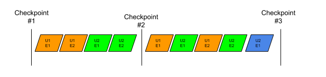
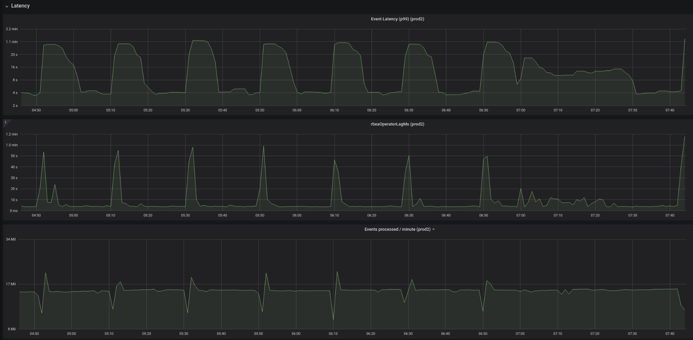
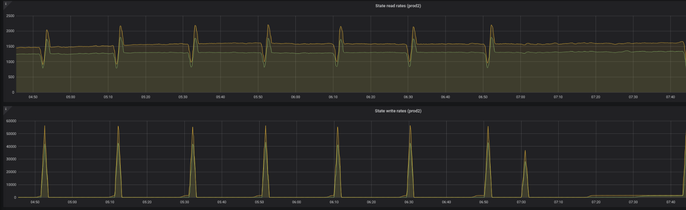
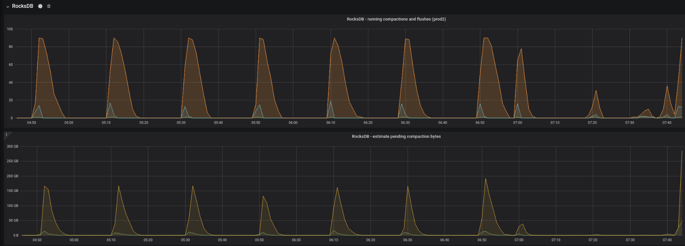
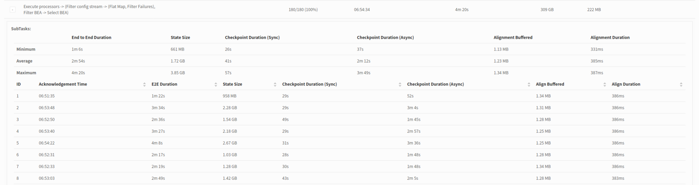
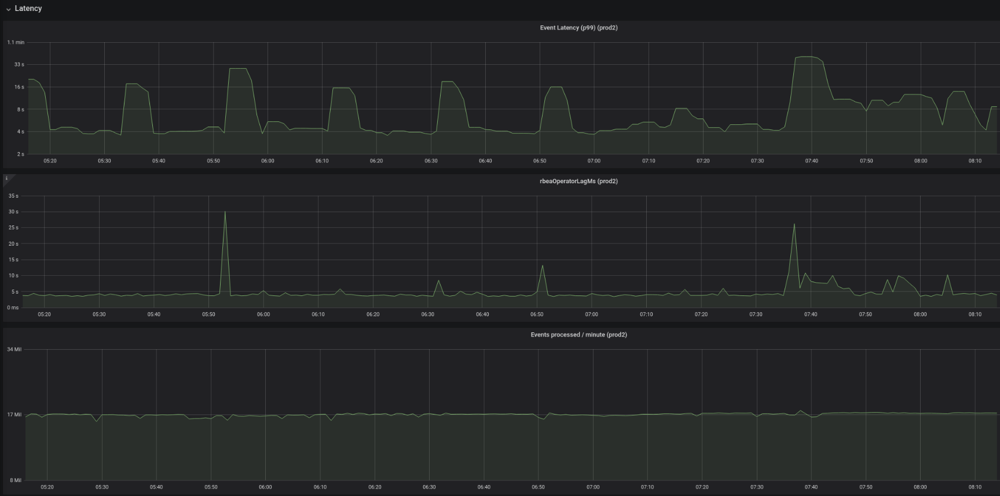
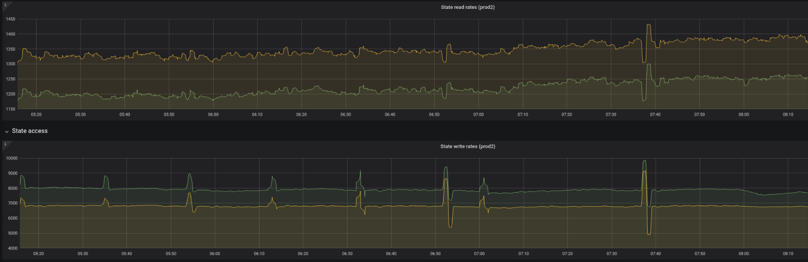
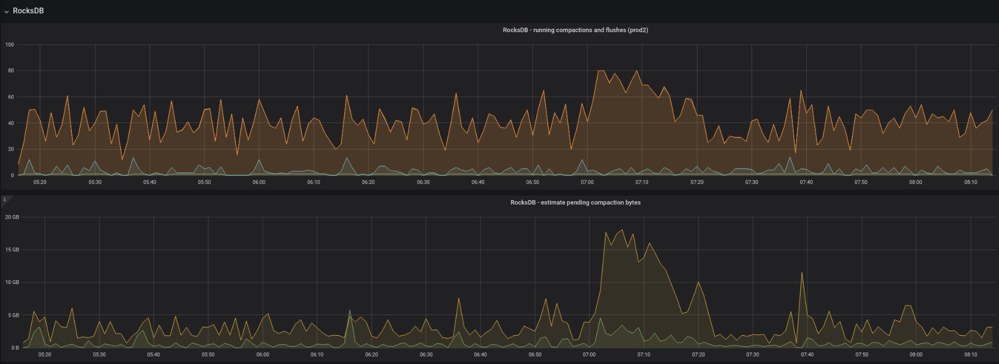
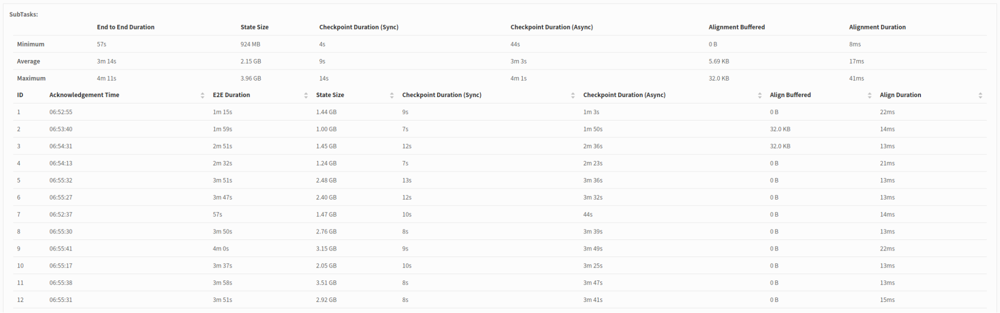
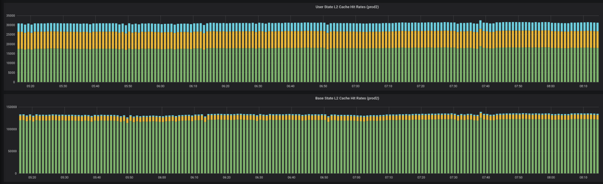

# State Cache for Flink state


State Cache is a single layer and two layered cache for caching Flink value states designed improve the performance of Flink applications using RocksDB state backend.

State Cache is stable and extensively used in King production environments.

# Usage

State usage can be easiest explained by having a look at an example.

State cache can only be used in a `KeyedStream` in which there is Keyed State to be cached, i.e. Caching Operator State is unsupported. 

To hook the State Cache to Flink state, you need to use a lower level API (`DataStream.transform()`) than you'd normally use, such as `DataStream.map()`. `transform` is a public API and methods like `DataStream.map()`  use that internally.

To use `DataStream.transform()`, you need to have a custom `AbstractStreamOperator`. That's also straightforward and again Flink internally uses that, e.g. a `DataStream.map()` becomes a `StreamMap` that is a subclass of `AbstractStreamOperator`.

```
        DataStream<Event> events = env.addSource(new ExampleSource());
        KeyedStream<Event, Long> keyedEvents = events.keyBy(Event::getUid);

        SingleOutputStreamOperator<Double> avg = keyedEvents.transform("magic", DOUBLE_TYPE_INFO,
                new ExampleOneInputStreamOperator());
```

In the operator itself, in `open()` you need to wrap a `ValueState` in a `CachingStateL2`. All access to that state needs go through the caching state object. That’s easiest accomplished by not having the wrapped value as a field, but just in the method as a local variable:

```
    public static class ExampleOneInputStreamOperator
            extends AbstractStreamOperator<Double>
            implements OneInputStreamOperator<Event, Double> {

        @Override
        public void open() throws Exception {
            ValueState<Map<String, Long>> state = getRuntimeContext().getState(
                    new ValueStateDescriptor<>("state", new MapTypeInfo<>(String.class, Long.class)));

            cachedState = CachingStateL2.<Long, Map<String, Long>>builder()
                    .maxSize(CACHE_L1_SIZE)
                    .maxSizeL2(CACHE_L2_SIZE)
                    .operator(this)
                    .state(state)
                    .cacheHitTracker(l1Hit -> l1Hits++)
                    .cacheHitTrackerL2(l2Hit -> { if (l2Hit) { l2Hits++; } else { misses++; } })
                    .build();

            super.open();
        }
```

What checkpointing, you need to call `updateAllStates()`. Don’t catch `Exception`s, if anything fails, it’s fatal. Flink calls `AbstractStreamOperator.snapshotState()` when checkpointing, so you can override that method. Remember to call `super.snapshotState(context)`!

```
        @Override
        public void snapshotState(StateSnapshotContext context) throws Exception {
            logger.info("Snapshotting: l1 hits {} l2 hits {} misses {} subtask {} checkpoint id {} ", l1Hits, l2Hits, misses, getRuntimeContext().getIndexOfThisSubtask(), context.getCheckpointId());
            cachedState.updateAllStates();
            super.snapshotState(context);
        }
```

The CachingStateL2-object is used like a normal `ValueState`, e.g getting the state value:

```
    Map<String, Long> map = cachedState.value();
```

The State Cache considers a cache entry dirty and flushes it to the underlying state when checkpointing if and only if `update()` has been called. This matches the contract of a normal `ValueState`.

# Background of two layered state caching in Flink

## Rationale

In a streaming application there always is lag, meaning a streaming application can never process an event immediately when the a system external to the streaming application creates the event. The lag is caused e.g. by various systems (Kafka, Pubsub etc) between the event source and the streaming application and the networking between those systems.

How much lag is tolerable depends on the use case.

Consider an example in which a mobile game displays an ad after each level the user finishes and playing each level takes one minute. The streaming application decides which ad to display based on information available on the moment the level is started. This gives the streaming application close to one minute to decide what to display. In this case a log of a few seconds or even tens of seconds is fine, but lag longer than one minute is not.

What the lag tolerance means from the streaming application development point of view is that we need to make design choices, implementations and have execution environments that keep the lag in the within tolerance limit.

Caching in general is a mechamisn that improves system performance. In King we've been until recently using single layered state caching to improve the system performance. We've witnessed that such a caching scheme doesn't only improve performance, but also _decreases the performance_ in some cases. This is not what caching should do, caching should always increase performance. In King we developed the layered state caching mechanism to overcome the issues caused by single layered caching.

## Description

RocksDB state backend in Flink has several key features over other state backends such as incremental checkpointing and support for larger memory state. However, it comes with a significant drawback explained in Flink documentation as follows:

> All reads/writes from/to this backend have to go through de-/serialization to retrieve/store the state objects, which is also more expensive than always working with the on-heap representation as the heap-based backends are doing.

As an example, let’s assume a Flink job with parallelism one, in which events are processed sequentially. We can assume that when processing each event the application issues a state get, mutates the state (Java object) and updates the state. Let’s also assume Flink state exists in RocksDB for all users. Furthermore, let’s assume max memtables is configured to one. The following diagram illustrates the stream of events and checkpointing. In the diagram e.g. `U1 E1` means the event one of the user one, `U2 E1` the event one of the user two, `U1 E2` the event two of the user one etc.



When the application processes `U1 E1` it issues a RocksDB get operation, state deserialization, the actual processing of the event, state serialization and a RockdbDB put. To process `U1 E2`, the application will perform the same steps again for the same user and same state name (naturally for a different state value).

From the RocksDB point of view, the get operation accesses memtable(s) to find the key. For the first event of `U1`, the key is not found in the memtables and it’s retrieved from the levels (on disk / block cache). The put for `U1` places the record to the memtable. The RocksDB get for `U1 E2` will find the key in the memtable, the put operation will store the key in the memtable. From RocksDB point of view, the key U1 is essentially put and immediately retrieved.

When the application processes `U1 E2` is processed, it looks nonoptimal that it needs to issue a RocksDB get and deserialize the data since in the same processing thread that just had the Java object in a local variable. If the thread "persisted" that variable somehow between events, it wouldn’t need to get it from RocksDB. In fact, if the thread didn’t need to get the key from RocksDB for `U1 E2`, the key wouldn’t need to be put in there in the first place after processing `U1 E1`. It sounds like some kind of caching could be applied here!

When implementing caching we can have a look at Flink `FsStateBackend` for inspiration. The state `FsStateBackend` stores in the heap after any state mutation is dirty compared to the state store in the persistent store (for checkpoints) such as HDFS. In Flink it’s completely fine to have a dirty state in volatile memory or disk. Flink takes a consistent snapshot of the state as part of the  checkpointing process, between checkpoints the state can be dirty. Correspondingly, when using RocksDB, the state in RocksDB needs to be consistent _only when checkpointing_. The RocksDB state backend already takes advantage of this property internally - the memtable(s) that contain information that eventually needs to be persisted is stored in RAM, and it’s guaranteed that they are completely flushed to disk during RocksDB snapshotting.

State cache maintains an in-heap LRU cache of the user states and doesn’t propagate each state update to RocksDB and doesn’t require each state get to go to RocksDB. State cache is hooked to the checkpointing and so that all dirty entries in the cache are flushed to RocksDB.

There are two modes of state cache:

* _Single layered cache_: a write-back cache, entries are explicitly flushed to RocksDB
* _Two layered cache_ : L1 write-back cache and L2 write-through cache, in L2 entries are flushed to RocksDB when put in L2

Let’s see using the previous diagram how single layered caching works. Let’s assume that the cache is initially empty and has a maximum capacity of two entries. `U1 E1` is a cache miss and causes a RocksDB get operation. The cache now contains `U1` (with a dirty value). Processing `U1 E2` is a cache hit and mutating the state causes no additional cache or RocksDB operations. After the events of `U2` have been processed, `U1` and `U2` are in the cache. On Checkpoint #1, both the values in the cache are dirty and the cache issues a RocksDB put for `U1` and `U2` and marks the entries clean in the cache (so that they don't need to be flushed in further checkpoints). After Checkpoint #1, the two `U1` and two `U2` events are processed without RocksDB operations. When processing the event `U3 E1`, the user `U3` is not found in the cache. Since the cache is full, `U1` is evicted from it and the state of `U1` is put to RocksDB and the state of `U3` is instead placed in the cache. On Checkpoint #3, the states of `U2` and `U3` are put to RocksDB and cache entries are marked clean.

Let’s now see how two layered cache would work. This time there is a two-layered cache comprising L1 cache of size one and L2 cache of size one. `U1 E1` causes a L1 and L2 cache miss and a RocksDB get operation. The key is placed in `L1` cache (now only contains `U1`). When processing `U1 E2`, there is an L1 hit, and `U1 E2` causes no RocksDB operations. `U2 E1` causes a `L1` and `L2` miss. `U2` is put to L1, causing `U1` to be evicted to L2, and `U1` is serialized and written to RocksDB. L1 now contains `U2`, and L2 `U1`. `U2 E2` is an L1 hit. On the Checkpoint #1, State cache needs to flush L1 and issues a RocksDB put for `U2`. `U2` in L2 cache is not dirty.

The issue with the state cache is that it is essentially not a transient cache, but effectively the top tier of the state storage:

* L1 cache
* (L2 cache)
* RocksDB memtable
* RocksDB level data
* Persistent storage (HDFS, GCS, …)

When checkpointing the tiers are flushed all the way from top down. The cache flushes the entries to RocksDB, RocksDB flushes memtables and Fink persists the RocksDB snapshot to persistent storage. The synchronous stage of checkpointing blocks the Flink pipeline and thus should be as short as passing. The flushing of the cache to RocksDB has to be done in the synchronous stage and needs to be fast. Flushing is an O(N) operation proportional to the number of dirty entries in the cache.

Now if we look at the single layered cache, the bigger the cache is, the better is the performance between checkpoints, since the active keys are likely in the cache. However, the bigger the cache, the worse the checkpointing performance is, since there are more keys the cache flushes to RocksDB when checkpointing. Optimally caching in computing works so that the bigger the cache is the better is the performance. This is obviously not the case using a single layered cache.

In two layered cache, L1 cache is kept relatively small and L2 relatively large. Increasing L2 size improves between checkpoints performance, but unlike single layered cache, doesn’t worsen the checkpointing performance. However, using two layered caches causes more RocksDB puts between checkpoints and serialization(s) of state, causing higher CPU usage. In the worst getting a value in two layered cache requires two gets to Java hashmaps, opposed to one get when using single layered cache. It’s possible the Flink checkpoints grow in size, because the same user can be written more often to the RocksDB state, because L1 is smaller than the single layered cache.

# Case study - caching in RBEA in King

## RBEA system in King

The RBEA system in King is a streaming Flink application mainly processing events originating from mobile games. For more details of the system, you can e.g. check out [presentation from Flink Forward 2016](https://www.youtube.com/watch?v=17tUR4TsvpM).
 
In RBEA a per user event belongs to a session that typically spans << 30 minutes. After the session ends, there typically are no events for that user for a while (e.g. hours). There are a significant number of events per session. The daily user count is greatly higher than count of active session at any given time.

The state value type is a complex POJO, typically a hashmap (not to be confused with the hashmaps in the cache). The keys of the map represent a “substate id” and the values the value of that substate. The substate can be basically anything, ranging from a primitive type and a POJO to a more complex data type such as `TreeMap`. There is a large number of keys (> 10) in the state and some of the values are large (>10 kilobytes).

Serialization of the state is computationally expensive because the map has many keys and some of the values are large. Storing and retrieving the state is an expensive RocksDB operation because of the size of the state.

### Single layered cache

In the following images you can see characteristics of the system performance using single layered caching. The cache size is 20 000 entries (per parallel task). Checkpointing interval is 15 minutes.

The checkpoints are performed at around 4:50, 5:10, 5:30, 6:10, 6:20, 6:50 etc. It can be seen that on checkpointing, the latency (measured comparing wall clock time to the timestamp of the event) goes up and events processed per minute goes down.



State read rate (RocksDB gets / second) reveals a pattern in which the read count drops during checkpointing because the pipeline is stuck and spikes slightly after checkpointing because the job processes the events that were queued during the checkpointing. The write rate (RocksDB puts / s) reveals that during checkpointing there’s a massive spike because all dirty keys are flushed and between checkpointing the rate write falls close to zero, since there's very little cache eviction. On some of our RBEA instances the write rate actually falls to zero. This is because the cache size is bigger than the count of users between checkpoints and all entries fit in the cache.



On the RocksDB side, it can be seen that after checkpointing all the states that were flushed from the cache need to be handled. In our setup, the written data doesn’t fit to memtables and there’s a spike on the flush and compaction RocksDB needs to be perform and correspondingly on the compactions running.



In the Flink UI an example checkpoint looks like in the below screenshot. It can be seen the sync stage of the checkpointing is tens of seconds long (min 26s, avg 41, max 57). 



### Two layered cache

RBEA was switched to use two layered cache with L1 size 2 000 and L2 size 23 000, replacing the single layer cache of size 20 000. L1 size is magnitude smaller than the size of the single layered cache. The following data is fetched from our live system a day after the update around the same time of the day as the previous images making the results comparable.

It can be seen there still is latency during checkpointing. The events / minute is almost stable, the effect of checkpointing can hardly be seen.



The state write rate has a constant load and the spikes are now in the scale of 10 - 15 % of the base load.



The RocksDB pending compaction bytes has one spike of 18GB, otherwise it’s stable. The count of running compaction is essentially constant.



The duration of the synchronous stage of checkpointing is 4 - 14 seconds.



The cache hit rates (hits / seconds) are essentially constant. L1 hit means the key was found in L1, L2 hit means the entry was found in L2 and L2 miss means the key wasn’t found in the cache. There are two caches in the system (it doesn’t matter what their difference is), the total hit rate (L1 + L2 hit rate) of the caches are 93% and 98%. 



### Comparison

The following table surfaces some changes in performance between single layered cache and two layered cache.

|                               |             |             | Single layered cache | Two layered cache | Change |
|-------------------------------|-------------|-------------|----------------------|-------------------|--------|
| max latency (s)               |             |             | 90                   | 35                | -61%   |
| Checkpoint duration async (s) | min         |             | 26                   | 4                 | -85%   |
|                               | avg         |             | 41                   | 9                 | -78%   |
|                               | max         |             | 57                   | 14                | -75%   |
| Operator checkpoint size (GB) | avg         |             | 1720                 | 2150              | 25     |

It can be seen that the maximum end user visible latency has dropped 61%. The main contributor to the latency is the synchronous stage of the checkpointing of the processing operator that is now at least 75% shorter than before.

One of the drawbacks of two layered cache can be seen in the checkpoint size that has grown 25% on average.
